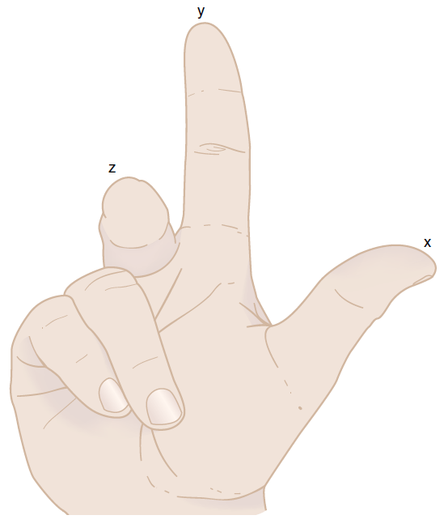
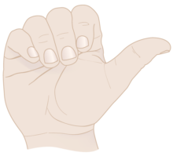
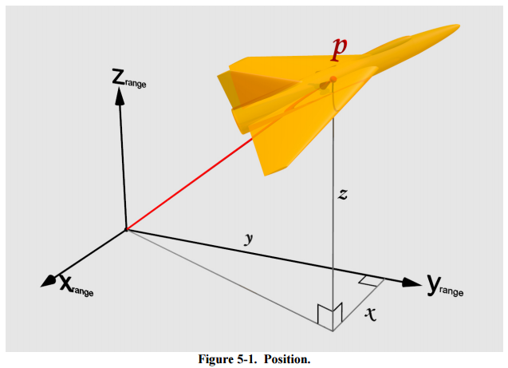

## Metrics Units/Scale and 3D Coordinate Systems

Unreal Units (UU) are 1 cm, 0.01 of Blender/SecondLife. Left handed, +x forward, +y right, +z up.

Unity Units are by default 1 m, terbukti dari setting gravity default 9.81 (m/s) yang sesuai reality, tapi memang Unity lebih lax dalam urusan unit.
Left handed, x+ right, y+ up, z+ forward.

Blender Units (BU) are usually 1 m. See [Static Mesh from Blender](https://wiki.unrealengine.com/Static_Mesh_from_Blender).
Right handed but +z up: +x is to left, +y incoming, +z up. From Blender to X3D: rotate +90deg (CCW) on z axis. From X3D to Blender: rotate -90 (CW) on z axis.

* Dari Blender, pas export FBX, gunakan export scale 1 aja, jadi unit si model tetap meter.
* Di Unreal, pas import FBX, gunakan import scale 0.01. Dari meter menjadi cm.
* Di Unity, pas import FBX, gunakan import scale 1. Dari meter tetap meter.

[Second Life / OpenSimulator](http://wiki.secondlife.com/wiki/Coordinate) uses meters.
A sim is 256×256 (x×y) meters. x is longitude (from west to east, [verified here](http://xahsl.org/sl/build_pos.html)), y is latitude (from south to north).
z is altitude where 0 is lowest possible point.

[OSM-3D.org](http://osm-3d.org)

See: 

* [3D Geodata Infrastructure (GDI-3D)](http://koenigstuhl.geog.uni-heidelberg.de/gdi-3d/), this hosts:
    * [OpenStreetMap-3D](http://www.OSM-3D.org): Combining free and user generated data from OpenStreetMap with SRTM DEM - currently for entire Germany.
    * [NorthRhine-Westphalia-3D](http://www.nrw-3d.de): All - over 6 Million - LOD1 buildings from GeoBasis.NRW in GDI-3D
    * [Heidelberg-3D](http://www.heidelberg-3d.de):  Official data combined with textured high resolution building models of Heidelberg
* [Web 3D Service (W3DS)](http://www.w3ds.org/doku.php), related to and mentions CityGML in the spec, menggunakan X3D spec juga.
* [Web3D Consortium / X3D](http://www.web3d.org/) used by NASA, DoD, Intel, IBM, National Institute of Health, Toshiba... curiously Google is missing? ISO/IEC standards:
    * [ISO/IEC 18026:2009(E) Spatial Reference Model (SRM)](http://standards.sedris.org/18026_Ed2/ISO_IEC_18026_Ed2/ISO_IEC_18026_NOTES.html)
    * ISO/IEC 18026:201x, Information technology — Spatial Reference Model (SRM) (to be published)
    * ISO/IEC 19775-2, Information technology — Computer graphics, image processing and environmental data representation — Extensible 3D (X3D) — Part 2: Scene access interface (SAI)
    * ISO/IEC 19776, Information technology — Computer graphics, image processing and environmental data representation — Extensible 3D (X3D) encodings
* [CityGML](http://www.citygml.org/)
* [OSM2World](http://wiki.openstreetmap.org/wiki/OSM2World), bisa tagging ada pintu, kursi, dll.
* [X3DOM](http://www.x3dom.org/)

[X3D Geometry3D](http://www.web3d.org/documents/specifications/19775-1/V3.3/Part01/components/geometry3D.html): facing north, means +x right, +y up, +z incoming. Same as OpenGL.



From [X3D Concepts](http://www.web3d.org/documents/specifications/19775-1/V3.3/Part01/concepts.html): ISO/IEC 19775 uses a Cartesian, right-handed, three-dimensional coordinate system. By default, the viewer is on the Z-axis looking north to the -Z-axis toward the origin with +X to the right/east and +Y straight up. A modelling transformation (see the Transform node definition in [10 Grouping component](http://www.web3d.org/documents/specifications/19775-1/V3.3/Part01/components/group.html) and the Billboard node definition in [23 Navigation component](http://www.web3d.org/documents/specifications/19775-1/V3.3/Part01/components/navigation.html)) or viewing transformation (see the X3DViewpointNode node type definition in [23 Navigation component](http://www.web3d.org/documents/specifications/19775-1/V3.3/Part01/components/navigation.html) can be used to alter this default projection.
[X3D Scene Authoring Hints - Coordinate Systems](http://www.web3d.org/x3d/content/examples/X3dSceneAuthoringHints.html#CoordinateSystems): 

* Each Transform node can create a new relative coordinate system for all children nodes in the scene graph.
    * Each set of axes follows the right-hand rule (RHR) for coordinate systems.
* Angular rotations are expressed in radians, using right-hand rule (RHR) with thumb pointing along positive direction for axis of interest and the other fingers curling in the direction of positive rotation.
    * Each set of orientations follows the right-hand rule (RHR) for angle rotations.
    * 
* Local/world coordinate systems:
    * +X-axis is nose/East
    * +Y-axis is vertical/up
    * +Z-axis is right-hand side (RHS)/South.

Tapi koq SRM itu menggunakan z+up ya... ga kaya X3D yang y+up. Kayanya mending ikut X3D deh yang interoperable dan sudah banyak support.



Koordinat $(0,0,0)$ adalah origin (pojok southwest) dari si tile dari Tile Map Service (TMS).
Maka semua koordinat scene adalah untuk X pasti positif (dari west=0 ke east), dan untuk Z pasti negatif (dari south=0 ke north).

### Right-handed to Left-handed

* Between Right-handed and Left-handed: flip an axis
* Between Y-up and Z-up: just swap the Y and Z, retain handedness

### Units

From [X3D Concepts](http://www.web3d.org/documents/specifications/19775-1/V3.3/Part01/concepts.html):

Table 4.2 lists the initial base units for ISO/IEC 19775.

Table 4.2 — Standard units

| Category  | Initial base unit |
|-----------|-------------------|
|angle	| radian |
|force	| newton |
|length	| metre |
|mass	| kilogram |

Table 4.3 — Derived units

| Category  | Initial base unit |
|-----------|-------------------|
| acceleration |	$length/second^2$ |
| angular_rate |	$angle/second$ |
| area	| $length^2$ |
| speed	| $length/second$ |
| volume |	$length^3$ |

The standard colour space used by this International Standard is RGB where each colour component has the range [0.,1.].

### Konversi ke Game Engine Coordinates

Dalam sistem Lumen yang dipakai sebagai standar adalah sistem X3D. Jadi pada saat image recognition/tracking, semua koordinatnya menggunakan aturan X3D.

* Dari koordinat Lumen ke Unreal, pada saat visualisasi Unreal, transformasi, lalu koordinatnya akan discale menjadi Unreal Units (×100).

    ```
    xUnreal <- -zIso * 100
    yUnreal <- xIso * 100
    zUnreal <- yIso * 100
    ```

    Sebaliknya dari Unreal ke Lumen, koordinatenya discale menjadi Blender/X3D units (×0.01), lalu swap y dan z, lalu flip z.

    ```
    xIso <- yUnreal * 0.01
    yIso <- zUnreal * 0.01
    zIso <- -xUnreal * 0.01
    ```
    
* Dari koordinat Lumen ke Unity, pada saat visualisasi Unity:

    ```
    xUnity <- xIso
    yUnity <- yIso
    zUnity <- -zIso
    ```

    Sebaliknya dari Unity ke Lumen:
    
    ```
    xIso <- xUnity
    yIso <- yUnity
    zIso <- -zUnity
    ```

Untuk rotasi 3D, menggunakan style X3D. See also: [rotation Unreal](https://docs.unrealengine.com/latest/INT/API/Runtime/Core/Math/FRotator/index.html). Unit sudut adalah degrees (counterclockwise+) agar lebih mudah karena sudut degrees juga dipakai oleh Unreal/Unity/Blender, meski standar ISO adalah radian. Pas kalkulasi internal baru diubah ke radian. Nama sudutnya buka alpha, beta, gamma tapi yang lebih deskriptif yaitu pitch (tengadah), roll (geleng clockwise), yaw (menoleh ke kiri):

* Pitch (RX):  Looking up and down (0=Straight Ahead, +Up, -Down).
* Roll (RY): Rotation about axis of screen, 0=Straight, +Clockwise, -CCW.
* Yaw (RZ):  Rotating around (running in circles), 0=North, +West, -East. Kalo di Unreal: 0=East, +North, -South.

### Tile Map Service (TMS)

Untuk mendapatkan scene, gunakan koordinat TMS seperti yang digunakan oleh OpenStreetMap/OSM-3D/GDI-3D.
Karena ada LOD, jadi bisa ada beberapa scene untuk tempat yang sama. Ini dapat digunakan Lumen sebagai konteks, apakah ingin mengolah
sebuah ruangan (LOD 18), atau mengolah sebuah kota (LOD 11). Beda LOD, maka ukuran sebuah tile juga berbeda.

## 2D to 3D

Secara umum formulanya seperti ini: (dari [OpenCV Camera Calibration and 3D Reconstruction](http://docs.opencv.org/modules/calib3d/doc/camera_calibration_and_3d_reconstruction.html), belum memasukkan koefisien distorsi radial dan tangential)

$$s \cdot uv = s \begin{bmatrix} u \\ v \\ 1 \end{bmatrix} =
ICM \left[\begin{array}{c|c} R & t \end{array}\right] xyz =
\begin{bmatrix} f_x & 0 & c_x \\ 0 & -f_y & c_y \\ 0 & 0 & 1 \end{bmatrix}
\large{\left[\begin{array}{c|c} R & \mathbf{t} \end{array}\right]}
\begin{bmatrix} x \\ y \\ z \\ 1 \end{bmatrix}
$$

* ICM : intrinsic camera matrix
* $[R|t]$ = ECM = VM : extrinsic camera matrix = view matrix. How the _world_ is transformed *relative to the camera*.
* $-f_y$ dibikin minus agar sesuai koordinat 2D image (u+ kanan, v+ bawah)

Artinya untuk sebuah point 3D $(x,y,z)$ di _world coordinates_ menjadi _image coordinates_ ada 3 step pemrosesan: (penjelasan kerennya ada di [Dissecting the Camera Matrix, Part 2: The Extrinsic Matrix](http://ksimek.github.io/2012/08/22/extrinsic/))

1. $\mathbf{t}$. Translasi dari world position menjadi camera-relative position. Setelah step ini koordinat $(0,0,0)$ berarti posisi camera.
2. $R$. Rotasi. Setelah step ini maka right vector $(1,0,0)$, forward vector $(0,1,0)$, dan up vector $(0,0,1)$. Dengan kata lain titik 3D yang berada pada posisi tersebut persis di kanan, depan, dan atas kamera. Setelah step ini semua point berada pada _camera coordinates_. Ini setara dengan normalized camera dengan focal length 1 (meter) = $(f_x, f_y) = (1, 1)$ dan $(c_x, c_y) = (0, 0)$.
3. $ICM$. Transformasi dari camera position menjadi perspective. Hasilnya adalah $(s \cdot u, s \cdot v, s)$, lalu tinggal dibagi $s$ untuk mendapatkan $u$ dan $v$ yaitu _image coordinates_.

Untuk mendapatkan $[R|\mathbf{t}]$ dari posisi kamera $t_c$ dan rotasi kamera $R_c$, [maka](http://ksimek.github.io/2012/08/22/extrinsic/):

$$\left[
\begin{array}{c|c}
R & \mathbf{t} \\
\hline
\mathbf{0} & 1 \\
\end{array}
\right]
  = 
\left[
\begin{array}{c|c}
R_c^T & -R_c^TC \\
\hline
\mathbf{0} & 1 \\
\end{array}
\right]
$$

## OpenStreetMap & OSM-3D

### Layers

Included:

1. Aeroway: bandara
2. Amenity: toilets, telephones, banks, pharmacies, cafes, parking and schools
3. Barrier
4. Boundary
5. Building
6. Emergency
7. Geological
7. Highway
8. Historic
9. Landuse
10. Natural
11. Public Transport
12. Railway
13. Route
14. Waterway

Excluded:

1. Aerialway
2. Contact -- not a GIS thing
3. Contact Information -- not a GIS thing
4. Craft
5. Leisure
6. Man Made
7. Military
8. Office
9. Places
10. Power
11. Shop
12. Sport
13. Tourism
14. Traffic calming

### Export

Bandung Metro: http://www.openstreetmap.org/export#map=13/-6.9345/107.6052
http://api.openstreetmap.org/api/0.6/map?bbox=107.4705,-7.0111,107.74,-6.8579

LOD 13. Boundaries: lat=-7.0111..-6.8579, lng=107.4705..107.7400.

Jakarta Metro: https://mapzen.com/metro-extracts/ -> OSM XML

Indonesia: http://download.geofabrik.de/asia/indonesia.html

Tiles: http://wiki.openstreetmap.org/wiki/Slippy_map_tilenames

```{r}
library(pander)

deg2num<-function(lat_deg, lon_deg, zoom){
  lat_rad <- lat_deg * pi /180
  n <- 2.0 ^ zoom
  xtile <- floor((lon_deg + 180.0) / 360.0 * n)
  ytile = floor((1.0 - log(tan(lat_rad) + (1 / cos(lat_rad))) / pi) / 2.0 * n)
  return( c(xtile, ytile))
#  return(paste(paste("http://a.tile.openstreetmap.org", zoom, xtile, ytile, sep="/"),".png",sep=""))
}

deg2num.all<-function(lat_deg, lon_deg){
  nums <- as.data.frame(matrix(ncol=6,nrow=21))
  colnames(nums) <- c('zoom', 'x', 'y', 'mapquest_osm', 'mapquest_aerial', 'osm')
  rownames(nums) <- 0:20
  for (zoom in 0:20) {
    num <- deg2num(lat_deg, lon_deg, zoom)
    nums[1+zoom,'zoom'] <- zoom
    nums[1+zoom,'x'] <- num[1]
    nums[1+zoom,'y'] <- num[2]
    nums[1+zoom,'mapquest_osm'] <- paste('http://otile1.mqcdn.com/tiles/1.0.0/map/', zoom, '/', num[1], '/', num[2], '.jpg', sep='')
    nums[1+zoom,'mapquest_aerial'] <- paste('http://otile1.mqcdn.com/tiles/1.0.0/sat/', zoom, '/', num[1], '/', num[2], '.jpg', sep='')
    nums[1+zoom,'osm'] <- paste('http://a.tile.openstreetmap.org/', zoom, '/', num[1], '/', num[2], '.png', sep='')
  }
  return(nums)
}

num2deg<-function(zoom, xtile, ytile){
  n <- 2^zoom
  lon_deg <- xtile / n * 360.0 - 180.0
  lat_rad <- atan(sinh(pi * (1 - 2 * ytile / n)))
  lat_deg <- lat_rad * 180.0 / pi
  ret <- c(lat_deg, lon_deg)
  names(ret) <- c('lat_deg', 'lng_deg')
  return(ret)
}

# Bippo
# Aerial in Bandung only available to up zoom 11
pander(deg2num(-6.872410, 107.608834, 11))
# Note: the best zoom in most Bandung layers is 18
pander(deg2num(-6.872410, 107.608834, 18))
pander(deg2num.all(-6.872410, 107.608834))
pander(num2deg(18, 209430, 136088))
```

Bippo: -6,872410, 107.608834 -> tile zoom=18  x=209430 y=136088, at 6.872, 107.6

 * http://otile1.mqcdn.com/tiles/1.0.0/map/18/209430/136088.jpg
 * http://otile1.mqcdn.com/tiles/1.0.0/sat/11/1636/1063.jpg
 * http://a.tile.openstreetmap.org/18/209430/136088.png
 
ITB (entire): 

ITB (Labtek V):
